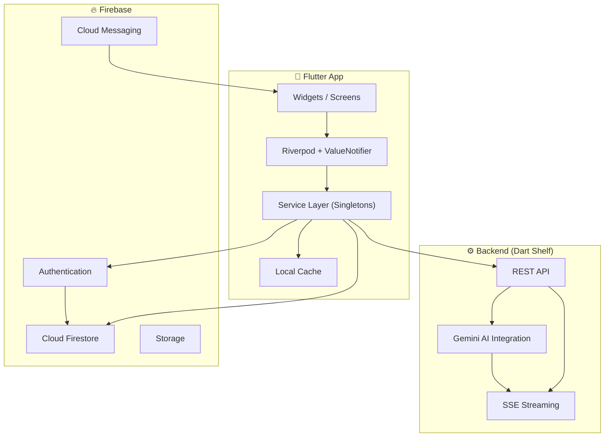

<div align="center">


# 🎓 TANDAU

### **Talent Analysis & Navigation for Dream University**

> *Умный навигатор по университетам Казахстана, помогающий абитуриентам* 
> *найти идеальный вуз и получить образовательный грант с помощью ИИ.*

[](https://flutter.dev)
[](https://dart.dev)
[](https://firebase.google.com)
[](https://ai.google.dev)
[]()
[]()

**[📲 Скачать APK](#-скачать)** · **[✨ Фичи](#-ключевые-возможности)** · **[🛠 Технологии](#-tech-stack)** · **[📧 Связаться](mailto:tandau.app.help@gmail.com)**

</div>

---

## 🔥 Проблема

Каждый год **130,000+** абитуриентов Казахстана проходят через стрессовый процесс выбора университета и подачи на грант. **Нет единого ресурса**, который объединяет данные, даёт персональные рекомендации и помогает сделать осознанный выбор.

## 💡 Решение

**TANDAU** — мобильное приложение, которое использует **AI и открытые данные МОН РК** для:

- 📊 **Расчёта шансов** на образовательный грант по алгоритму 4-х вузов
- 🤖 **Персональных стратегий** поступления от AI-консультанта (Google Gemini)
- 🏫 **Единого каталога** 50+ вузов с проходными баллами, стоимостью и отзывами

> 💡 **ТАҢДАУ** (каз.) — означает **«Выбор»**. Мы помогаем сделать правильный выбор.

---

## ✨ Ключевые возможности

<table>
<tr>
<td width="50%">

### 📊 Алгоритм 4-х вузов (СВД)
Расчёт шансов на грант на основе актуальных данных МОН РК и пороговых баллов прошлых лет. Полная прозрачность алгоритма и методологии.

</td>
<td width="50%">

### 🤖 AI-Консультант (Gemini)
Персональные стратегии поступления с поддержкой **потоковых ответов (SSE)**, **истории чатов**, обратной связи и антимат-модерации на 3 языках.

</td>
</tr>
<tr>
<td width="50%">

### 🏫 Каталог 50+ вузов
Подробная база: стоимость, проходные баллы, контакты, рейтинги и отзывы. **Оффлайн кэширование** для работы без интернета.

</td>
<td width="50%">

### ⚖️ Сравнение вузов
Сравнение до 2-х вузов на одном экране. Встроенный календарь дедлайнов поступления (ЕНТ, Гранты 2026).

</td>
</tr>
<tr>
<td width="50%">

### ⚡ Высокая производительность
Оптимизировано до нуля микро-лагов: кэширование списков, точечные `ValueNotifier`, быстрые анимации и `RepaintBoundary`.

</td>
<td width="50%">

### 🌍 Мультиязычность
Полная поддержка **русского**, **казахского** и **английского** языков через Flutter l10n с `.arb` файлами.

</td>
</tr>
</table>

---

## 🛠 Tech Stack

<div align="center">

| Слой | Технология | Назначение |
|:----:|:----------:|:----------:|
| 📱 **Frontend** | Flutter / Dart 3.10 | Кроссплатформенный UI |
| ⚙️ **Backend** | Dart Shelf (Render) | REST API + SSE стриминг |
| 🧠 **AI** | Google Gemini 2.0 Flash | Интеллектуальный консультант |
| 🗄 **Database** | Cloud Firestore | Данные, история чатов, отзывы |
| 🔐 **Auth** | Firebase Auth | Google, Apple, Email |
| 📬 **Push** | FCM | Уведомления |
| 🏗 **CI/CD** | Firebase Hosting | Лендинг + Privacy Policy |
| 📊 **State** | Riverpod + ValueNotifier | Реактивное управление состоянием |

</div>

---

## 🏗 Архитектура



---

## 📲 Скачать

### APK (Android)
Скачайте последнюю версию APK из [Releases](../../releases) или соберите самостоятельно:

```bash
# 📱 APK для установки на телефон
flutter build apk --release \
  --dart-define=IMGBB_API_KEY=<your_key>

# 📦 App Bundle для Google Play
flutter build appbundle --release \
  --dart-define=IMGBB_API_KEY=<your_key>
```

APK будет находиться в:
```
build/app/outputs/flutter-apk/app-release.apk
```

---

## 🚀 Быстрый старт

### Требования
- Flutter `3.x+` и Dart SDK `>=3.0.0 <4.0.0`
- Firebase проект с настроенными Auth, Firestore, FCM
- Android Studio / VS Code

### Установка

```bash
# 1. Клонируйте репозиторий
git clone https://github.com/Kriazer078/TANDAU.git
cd TANDAU

# 2. Установите зависимости
flutter pub get

# 3. Запустите приложение
flutter run
```

### Backend (Dart Shelf)

```bash
cd backend_dart
dart pub get
dart run bin/server.dart
```

> 🌐 Production backend: `tandau-backend.onrender.com`

---

## 🔒 Безопасность

| | Описание |
|:-:|:---------|
| 🛡 | Данные защищены **Firebase Auth** + **Firestore Security Rules** |
| 🔑 | API-ключи передаются через `--dart-define` — **не хранятся в коде** |
| 🔐 | Пароли хранятся в зашифрованном виде |
| 🗑 | Полное **удаление аккаунта** и всех данных пользователя |
| 🧹 | Антимат модерация на 3 языках (RU, KZ, EN) |
| ✅ | Соответствие требованиям Google Play к ИИ-продуктам |

---

## 📁 Структура проекта

```
tandau/
├── lib/
│   ├── main.dart              # Точка входа
│   ├── models/                # Модели данных
│   ├── services/              # Бизнес-логика (Singletons)
│   ├── screens/               # Экраны приложения
│   ├── widgets/               # Переиспользуемые виджеты
│   └── l10n/                  # Локализация (RU, KZ, EN)
├── backend_dart/              # Dart Shelf API сервер
├── test/                      # Widget & Unit тесты
├── docs/                      # Документация
├── assets/images/             # Иконки и изображения
└── firebase.json              # Firebase конфигурация
```

---

## 📋 Полезные ссылки

<div align="center">

| | Ссылка |
|:-:|:------:|
| 📄 | [Политика конфиденциальности](https://tandau-app.web.app/privacy_policy.html) |
| 🗑 | [Удаление аккаунта](https://tandau-backend.onrender.com/delete-account) |
| 📧 | [Email поддержки](mailto:tandau.app.help@gmail.com) |

</div>

---

## 🗺 Roadmap

- [x] Калькулятор грантов (СВД)
- [x] AI-Консультант с историей чатов
- [x] Каталог 50+ вузов с кэшированием
- [x] Сравнение вузов и дедлайны
- [x] Мультиязычность (RU, KZ, EN)
- [x] Потоковые ответы AI (SSE)
- [ ] 🔜 Публикация в Google Play
- [ ] 🔜 iOS версия в App Store
- [ ] 🔜 Рекомендательная система на ML

---

<div align="center">

### 🇰🇿 Сделано в Казахстане с ❤️

**© 2026 TANDAU** · *Talent Analysis & Navigation for Dream University*

**v1.1.0** · [tandau.app.help@gmail.com](mailto:tandau.app.help@gmail.com)

</div>
